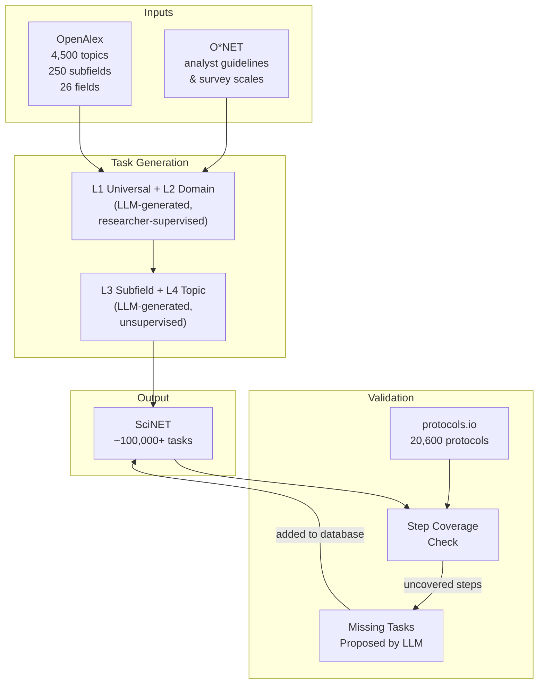
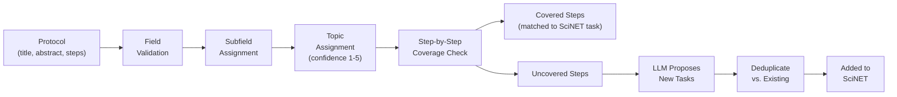

# SciNET Methodology

SciNET is an [O\*NET](https://www.onetonline.org/) for science: a comprehensive, hierarchically organized database of research task statements covering approximately 4,500 research topics from [OpenAlex](https://openalex.org/). This document describes how the database was built — from taxonomy construction through task generation, external validation, and quality filtering.



---

## Table of Contents

1. [Background and Motivation](#1-background-and-motivation)
2. [Taxonomy: Building on OpenAlex](#2-taxonomy-building-on-openalex)
3. [Task Statement Design](#3-task-statement-design)
4. [Task Generation](#4-task-generation)
5. [Validation Against Real-World Protocols](#5-validation-against-real-world-protocols)
6. [Task Rating and Filtering](#6-task-rating-and-filtering)
7. [Models and Infrastructure](#7-models-and-infrastructure)
8. [Ongoing and Future Work](#8-ongoing-and-future-work)
9. [Limitations](#9-limitations)

---

## 1. Background and Motivation

**[O\*NET](https://www.onetonline.org/)** (the Occupational Information Network) is the U.S. government's primary database of occupational characteristics. For hundreds of occupations, [O\*NET](https://www.onetonline.org/) records detailed task statements — collected through surveys of incumbent workers — and rates each task on three scales: how important it is, what fraction of workers perform it, and how frequently it is performed.

Scientific research is largely absent from [O\*NET](https://www.onetonline.org/) at useful resolution. [O\*NET](https://www.onetonline.org/) has entries for broad categories like "Biological Scientists" or "Economists," but not for the granular topics — Gene Editing, Monetary Policy, Quantum Computing — where research work actually differs. SciNET fills this gap by applying the [O\*NET](https://www.onetonline.org/) methodology at the level of [OpenAlex](https://openalex.org/) research topics.

The primary output is **~100,000+ task statements** organized across ~4,500 topics, ~250 subfields, and 26 fields.

---

## 2. Taxonomy: Building on OpenAlex

### 2.1 Starting point: the OpenAlex hierarchy

We began with the [OpenAlex](https://openalex.org/) topic classification, which organizes scholarly works into four levels:

| Level | Count | Example |
|-------|-------|---------|
| Domain | 5 | Physical Sciences |
| Field | 26 | Physics and Astronomy |
| Subfield | ~250 | Condensed Matter Physics |
| Topic | ~4,500 | Superconductivity and Magnetic Properties |

Each [OpenAlex](https://openalex.org/) topic comes with a short summary, keywords, and (where available) a Wikipedia link. These metadata are included in [`data/openalex_topics.csv`](data/openalex_topics.csv) and serve as context in the task-generation prompts.

### 2.2 Redefining fields and subfields

While [OpenAlex](https://openalex.org/) provides a useful starting taxonomy, its field-level groupings do not always match how researchers think of their disciplines. For example, [OpenAlex](https://openalex.org/) groups Economics, Sociology, and Psychology under a single "Social Sciences" field, but these are quite different research communities.

We addressed this by creating approximately 30 **display fields** that more closely track disciplinary boundaries. Some [OpenAlex](https://openalex.org/) fields were **split** (e.g., "Social Sciences" became Economics, Sociology, Political Science, Psychology, etc.) and some were **merged**. This is possible because [OpenAlex](https://openalex.org/) topics — the most granular level — can be freely rearranged across new field boundaries.

The mapping uses a two-pass approach:

1. **Rule-based assignment.** Most subfields can be deterministically mapped to a display field (e.g., "Cardiology" → Medicine & Clinical Sciences). Subfields that do not map unambiguously are flagged.
2. **LLM-based classification.** For ambiguous cases, a language model classifies the topic into one of the 30 display fields given the topic's name, keywords, and summary. Batches of up to 15 topics are processed per API call for efficiency.

We then asked the language model to define the major subfields within each display field — essentially asking, "If you were a researcher in Economics, how would you organize the major subfields?" These LLM-proposed subfields replaced the [OpenAlex](https://openalex.org/) subfield labels where they were unintuitive, and we then mapped each [OpenAlex](https://openalex.org/) topic into the newly defined subfields.

---

## 3. Task Statement Design

All SciNET tasks follow the [O\*NET](https://www.onetonline.org/) canonical task statement structure. The prompts used for task generation closely follow the instructions that [O\*NET](https://www.onetonline.org/) gives to human analysts:

```
[Action Verb] + [Object] + [Modifiers] + [Purpose]
```

**Writing rules (drawn from [O\*NET](https://www.onetonline.org/) analyst guidelines):**

- Begin with a present-tense action verb (e.g., *Analyze*, *Design*, *Develop*, *Estimate*, *Collect*)
- Include the object being acted on
- Add optional modifiers specifying how or under what conditions
- End with an optional purpose introduced by "to …"
- One core action per statement; avoid chained steps
- Approximately 8–18 words
- Plain language; avoid jargon unless necessary for precision
- Parallel structure across statements; mutual exclusivity encouraged

**Reference examples from [O\*NET](https://www.onetonline.org/):**

> "Analyze data from research conducted to detect and measure physical phenomena."

> "Plan, design, or conduct surveys using questionnaires, focus groups, or interviews."

> "Compile, analyze, and report data to explain economic phenomena and forecast trends."

Tasks are written at the level of a *research team*, not a single individual. Statements describe what a typical researcher in the field *does*, not what they might occasionally do.

### 3.1 Prompt engineering iterations

A significant challenge was controlling the level of specificity. In early iterations, the language model produced tasks that were far too detailed — naming specific datasets, niche methodologies, or narrow techniques that only a small fraction of researchers would use. We addressed this through several rounds of prompt refinement:

- The [O\*NET](https://www.onetonline.org/) analyst instructions were included in the prompt nearly verbatim.
- Explicit constraints were added: "AVOID HYPERSPECIFIC TASKS," "AVOID EXAMPLES THAT ARE TOO SPECIFIC, such as hyperspecific methodologies or datasets," and "CONSOLIDATE AGGRESSIVELY — if multiple tasks require the same skills or are part of the same workflow, combine them into ONE task."
- Coverage thresholds were built into the prompt (see [Section 4.5](#45-coverage-thresholds)), pushing the model toward tasks that a *majority* of researchers in the area perform regularly.

---

## 4. Task Generation

### 4.1 Design evolution

The task generation approach evolved through two stages:

**Initial approach (top-down, additive).** We started at the top of the hierarchy and worked downward. At each level, we asked the model to generate tasks that are common across all researchers in that scope, while explicitly omitting tasks that belong to more granular levels below. For example, at the field level, we asked: "What tasks do all Life Sciences researchers share?" and instructed the model to leave out subfield-specific work. Then at the subfield level, we asked for *additional* tasks distinctive to that subfield that were not already covered by the field-level list. This is the approach used in the **three-level pipeline** that produced the released data (see [Section 4.6](#46-three-level-pipeline-released-data)).

**Refined approach (hierarchical refinement).** We then developed a more structured architecture with four levels and explicit parent linkage. Instead of asking for "additional" tasks, we ask each lower level to *refine* specific tasks from the level above. Every L3 task must map to a specific L2 parent, and every L4 task must map to a specific L3 parent. This ensures the full hierarchy is traceable — any topic-level task can be followed up through its subfield parent, domain parent, and ultimately to a universal task. Tasks that cannot be assigned to a parent are not generated; the model is not instructed to create new parents.

### 4.2 Level structure (four-level architecture)

| Level | Scope | Source | Coverage threshold |
|-------|-------|--------|--------------------|
| L1 — Universal | All researchers | LLM-generated, researcher-supervised | — |
| L2 — Domain | e.g., Life Sciences | LLM-generated, researcher-supervised | — |
| L3 — Subfield | e.g., Economics | LLM-generated (unsupervised) | ≥ 70% of subfield researchers |
| L4 — Topic | e.g., Labor Market and Education | LLM-generated (unsupervised) | ≥ 80% of topic researchers |

### 4.3 Supervised levels (L1 and L2)

The universal and domain levels anchor the entire hierarchy and needed to be correct. Rather than writing these tasks from scratch, we developed them through an iterative process with Claude Opus: the model drafted candidate tasks, a researcher reviewed them, flagged issues, and the model revised — repeating until the tasks reflected the right level of granularity and mutual exclusivity. The result is LLM-generated content that has been carefully vetted.

**L1 — Universal tasks (25 tasks)**

These tasks apply to virtually all researchers regardless of field. They are organized into seven categories:

| Category | Tasks (count) | Examples |
|----------|---------------|---------|
| Ideation & Hypothesis Generation | 5 | "Identify gaps in existing literature to formulate novel research questions." |
| Data Gathering | 4 | "Design data collection protocols and instruments to ensure validity and reproducibility." |
| Data Analysis | 4 | "Apply statistical methods to test hypotheses and estimate effect sizes." |
| Writing & Communication | 4 | "Draft manuscripts describing research questions, methods, results, and interpretations." |
| Peer Review & Service | 2 | "Evaluate manuscripts submitted to journals for scientific rigor and contribution." |
| Mentorship & Teaching | 3 | "Supervise graduate students and postdoctoral researchers on research projects." |
| Administration & Collaboration | 3 | "Manage research budgets, personnel, and project timelines." |

The universal level ensures that tasks like grant writing, peer review, and mentoring — which are never mentioned in papers or protocols — are still represented in every researcher's task profile.

**L2 — Domain tasks (11–12 tasks per domain)**

L2 tasks are domain-specific refinements of L1 tasks. Each L2 task carries an explicit `l1_task_id` link to the L1 task it refines. Four research domains are covered:

| Domain | Tasks (count) | Example |
|--------|---------------|---------|
| Social Sciences | 12 | "Design surveys or questionnaires to measure attitudes, behaviors, or experiences." |
| Life Sciences | 12 | "Follow biosafety protocols when handling biological materials." |
| Physical Sciences | 12 | "Quantify measurement uncertainty and propagate errors through calculations." |
| Health Sciences | 11 | "Ensure compliance with patient privacy regulations (e.g., HIPAA)." |

These were also developed in the supervised iterative process described above.

### 4.4 Unsupervised levels (L3 and L4)

From the subfield level downward, task generation is fully automated. The language model receives the parent-level tasks as numbered input and must produce refinements that each map to a specific parent:

**L3 subfield prompt (excerpt):**

> You are generating task statements for researchers in {subfield\_name} (a subfield of {domain\_name}).
>
> INPUT: L2 DOMAIN TASKS ({domain\_name})
> These are the domain-level tasks. Your job is to generate subfield-specific refinements of these.
>
> OBJECTIVE: Generate subfield-specific refinements of the L2 tasks above. Each L3 task you generate should:
> - Refine ONE specific L2 task (specify which L2 task number it refines)
> - Be specific to {subfield\_name} (would NOT apply to other subfields)
> - Be common enough that **70%+ of {subfield\_name} researchers** do it regularly

**L4 topic prompt (excerpt):**

> Each L4 task you generate should:
> - Refine ONE specific L3 task (specify which L3 task number it refines)
> - You DO NOT need to have one L4 task for each L3 task. You may skip some L3 tasks, and some L3 tasks may have multiple L4 tasks.
> - Be specific to {topic\_name} (would NOT apply to other topics in {subfield\_name})
> - Be common enough that **80%+ of {topic\_name} researchers** do it regularly

Each generated task includes an explicit `l2_task_id` (for L3) or `l3_task_id` (for L4), enabling full parent-chain tracing from any L4 task up to the relevant L1 universal task.

### 4.5 Coverage thresholds

The coverage thresholds (70% at L3, 80% at L4) serve a dual purpose. They push the model toward tasks that represent common, substantial research activities — analogous to [O\*NET](https://www.onetonline.org/)'s concept of "relevance" — and they push against overly specific tasks (e.g., a particular niche dataset or one-off technique) that would inflate the task count without adding representational value. The tighter threshold at L4 reflects that topic-level tasks should be highly characteristic of the specific research area.

### 4.6 Three-level pipeline (released data)

The CSV files in this repository were produced by an earlier **three-level pipeline** (field → subfield → topic) using the additive approach described in [Section 4.1](#41-design-evolution). All three levels are fully LLM-generated (unsupervised):

- **Field level** (10–30 tasks): tasks common to all researchers across the field; subject to a "50%+ of researchers" heuristic; must not be subfield-specific
- **Subfield level** (10–30 tasks): tasks *additional* to field-level tasks that are distinctive of the subfield; prompt explicitly passes the field tasks and instructs the model not to paraphrase them
- **Topic level** (10–30 tasks): tasks *additional* to both field- and subfield-level tasks that are distinctive of the specific topic; prompt passes both parent levels

In this pipeline, child tasks are not required to map to a specific parent; they are simply "additional" tasks that the parent levels did not cover. The `level` column in `generated_tasks.csv` records which level each task was generated at.

**Execution:** Subfield tasks are generated in parallel using a thread pool. Topic tasks are generated via the [Anthropic Batch API](https://docs.anthropic.com/en/docs/build-with-claude/message-batches), which processes hundreds of topics concurrently.

### 4.7 Deduplication and quality control

- **Prompt-level:** The model is instructed to ensure mutual exclusivity across tasks and to avoid vague catch-all statements ("analyze data," "collect data"). Parent tasks are provided in the prompt explicitly so the model can avoid paraphrasing them.
- **Code-level:** After parsing model responses, a normalization function deduplicates tasks by exact string match after whitespace normalization.
- **Error handling:** If a model response cannot be parsed as valid JSON, a regex fallback extracts the task list from code blocks or raw text. Unparseable responses are logged as errors without discarding the run. All generation is checkpointed so interrupted runs can resume.

---

## 5. Validation Against Real-World Protocols

A central question is whether the LLM-generated tasks actually reflect what researchers do in practice. We validate task coverage against external protocol databases that document real research procedures step by step.

### 5.1 Protocols.io step coverage

[Protocols.io](https://www.protocols.io/) is a platform where researchers publish detailed laboratory and research protocols with step-by-step procedure lists. These provide a ground-truth record of what researchers actually do — independent of any LLM.

**Data collection:**

A corpus of approximately 20,600 protocols was assembled from three sources:
- Public protocols available via the protocols.io search API
- Unlisted protocols with DOIs indexed in [OpenAlex](https://openalex.org/)
- Additional protocols identified through CrossRef under the protocols.io DOI prefix (10.17504)

Crucially, protocols.io protocols carry DOIs, which allows the vast majority to be merged with [OpenAlex](https://openalex.org/). This gives us the field each protocol belongs to and — in principle — its topic. However, we found that [OpenAlex](https://openalex.org/)'s topic-level classification for protocols was often poor, so we built an LLM-based assignment pipeline.

**Assignment and coverage pipeline:**

For a pilot of 1,000 randomly selected protocols, each protocol was routed to the SciNET topic it best represents and then checked for step-by-step coverage:



1. **Field validation.** A language model checks whether the [OpenAlex](https://openalex.org/)-assigned field is correct given the protocol title, abstract, and first three steps. If not, it suggests the correct field. (In pilot runs, roughly 70% of protocols had incorrect [OpenAlex](https://openalex.org/) field assignments.)
2. **Subfield assignment.** Given the corrected field, the model selects the best subfield.
3. **Topic assignment.** The model selects the best-matching SciNET topic from a list of candidates within the subfield, and provides a confidence score (1–5). Only protocols with confidence ≥ 4 are used in downstream analysis.
4. **Step coverage.** For each procedure step in the protocol, the model determines whether it is covered by any existing SciNET task at the topic, subfield, or field level. Steps are classified as *placeholder* (instructions to follow a prior protocol, excluded from coverage calculations), *prep* (routine preparatory actions), or *substantive* (steps corresponding to meaningful research tasks). Coverage is the fraction of non-placeholder steps matched to a SciNET task.

**Results:** With correct field routing, step coverage exceeds 85% for most protocols, indicating that SciNET's task database captures the large majority of substantive research activities described in real protocols.

**Adding missing tasks:**

Uncovered steps are not discarded. They are grouped by (field, subfield, topic), and a language model proposes new [O\*NET](https://www.onetonline.org/)-style task statements to cover them. Proposed tasks are then deduplicated against existing SciNET tasks using sequence similarity matching (threshold: 90% character overlap) before being added to the database. The pilot used 1,000 protocols; the full corpus of 20,600 provides room for continued expansion.

### 5.2 Bio-protocol

A second external validation source is [Bio-Protocol](https://bio-protocol.org/), a peer-reviewed journal that publishes detailed experimental protocols primarily in the life sciences. A corpus of approximately 85,000 protocols was scraped. Each protocol includes title, abstract, procedure steps with durations, materials list, and author affiliations. This corpus provides complementary coverage in molecular biology and related domains that are well-represented in Bio-Protocol but less so in protocols.io.

---

## 6. Task Rating and Filtering

In addition to generating tasks, SciNET rates each task following [O\*NET](https://www.onetonline.org/) methodology to distinguish "core" tasks (performed by most researchers in an area) from "supplemental" ones.

### 6.1 Rating scales

[O\*NET](https://www.onetonline.org/) collects three ratings for each task from incumbent workers:

| Scale | Abbreviation | Range | Question |
|-------|-------------|-------|---------|
| Importance | IM | 1–5 | "How important is this task to your job?" |
| Relevance (% workers) | RT | 0–100% | "What percentage of workers in this occupation perform this task?" |
| Frequency | FT | 1–7 | "How often is this task performed?" (1=yearly or less, 7=hourly or more) |

SciNET replicates this survey by prompting a language model to play the role of a researcher with 10+ years of experience in the target occupation and to rate all tasks for that occupation simultaneously. The batched design — rating all tasks in a single API call — provides consistency within a rating session.

### 6.2 Calibrating the rating prompt

Out of the box, the model's rating distributions did not match [O\*NET](https://www.onetonline.org/) — it was too optimistic about Importance (rating most tasks 4–5) and too conservative on Relevance. We calibrated the prompt iteratively:

1. **Baseline.** We obtained the actual distributions of IM, RT, and FT ratings from [O\*NET](https://www.onetonline.org/) for scientific occupations.
2. **Unguided LLM ratings.** We ran the prompt with no distribution guidance and compared the resulting distributions to [O\*NET](https://www.onetonline.org/).
3. **Adding distribution anchors.** We added explicit distribution targets to bring the LLM closer to the [O\*NET](https://www.onetonline.org/) baseline (e.g., for RT: "100 should be your most common answer — use it for ~30% of tasks"; for IM: "Most tasks should be rated 3–4; only a small minority receive 5").
4. **Validation.** We tested the calibrated prompt against 425 researcher-relevant [O\*NET](https://www.onetonline.org/) tasks across 40 scientific occupations:

| Scale | Pearson r | 95% CI | LLM mean | [O\*NET](https://www.onetonline.org/) mean | Bias |
|-------|-----------|--------|----------|-------------|------|
| Importance (IM) | 0.60 | [0.535, 0.657] | 3.68 | 3.83 | −0.15 |
| % Workers (RT) | 0.63 | [0.566, 0.682] | 80.0 | 86.0 | −5.93 |
| Frequency (FT) | 0.76 | [0.719, 0.799] | 3.23 | 3.29 | −0.06 |

### 6.3 Core vs. Supplemental classification

| Category | Criteria |
|----------|---------|
| **Core** | RT ≥ 50% AND IM ≥ 3.0 ("Important") |
| **Supplemental** | Does not meet both Core thresholds |

The RT threshold of 50% is set below [O\*NET](https://www.onetonline.org/)'s conventional 67% to account for the systematic downward bias in LLM relevance estimates identified during calibration. The IM threshold of 3.0 matches [O\*NET](https://www.onetonline.org/) practice. Frequency (FT) is recorded but not used for filtering.

---

## 7. Models and Infrastructure

| Component | Model | Notes |
|-----------|-------|-------|
| Task generation (3-level) | Claude Sonnet 4.5 | Field, subfield, and topic tasks |
| Task generation (4-level) | Claude Opus 4.5 | L3/L4 tasks |
| L1/L2 task development | Claude Opus 4.5 | Iterative, researcher-supervised |
| Protocols.io validation | Claude Sonnet 4.5 | Multi-phase routing and coverage |
| Rating calibration | Claude Opus 4.5 | [O\*NET](https://www.onetonline.org/) gold-standard comparison |
| Field/subfield classification | Claude Sonnet 4.5 | Taxonomy mapping |

All models are accessed via the Anthropic API. Topic-level task generation uses the [Anthropic Batch API](https://docs.anthropic.com/en/docs/build-with-claude/message-batches), which provides a 50% cost reduction and higher throughput. Prompt caching (ephemeral) is used for system prompts and shared context blocks. All long-running pipeline steps checkpoint results incrementally so that interrupted runs can resume without reprocessing completed items.

---

## 8. Ongoing and Future Work

The current release covers task generation and initial validation. Several additional data sources and validation strategies are in progress:

- **Expanded protocols.io validation.** The pilot used 1,000 protocols; the remaining ~19,600 in the corpus are being processed to identify further coverage gaps and generate additional tasks.
- **Video protocols.** Researchers also document their work in video format. We are collecting video protocol transcripts, which can be fed through the same coverage pipeline to test whether SciNET captures the research process as described in spoken walkthroughs.
- **Full-text papers.** [OpenAlex](https://openalex.org/), arXiv, and other repositories provide full-text access to research papers. The methods sections of papers offer a rich description of what researchers actually did, and can be used to validate or extend SciNET's task coverage — particularly for computational, theoretical, and social science topics that are underrepresented in laboratory protocol databases.
- **Expert surveys.** We are developing a survey instrument to collect researcher opinions on task coverage, importance, and time allocation. This will provide direct human validation complementing the LLM-based ratings.
- **Patents.** Patent filings describe research and development processes in detail. We have access to patent data and are exploring its use as an additional validation source, particularly for applied research and engineering topics.

---

## 9. Limitations

**LLM as simulated respondent.** The coverage thresholds (70%, 80%) and the Core/Supplemental classification rely on LLM judgments, not surveys of actual researchers. While correlations with [O\*NET](https://www.onetonline.org/) human surveys are meaningful (r = 0.60–0.76), the LLM is not a perfect proxy for incumbent workers. The calibration exercise used scientific occupations from [O\*NET](https://www.onetonline.org/), but these are broader than SciNET's specific topics.

**English-language bias.** Task statements are generated in English using English-language topic labels and keywords. Research practices may differ across linguistic or cultural contexts not well-represented in either [O\*NET](https://www.onetonline.org/) or the underlying LLMs' training data.

**[OpenAlex](https://openalex.org/) taxonomy drift.** [OpenAlex](https://openalex.org/) periodically revises its topic labels and assignments. The `old_topic_label` and `new_topic_label` columns in `openalex_topics.csv` reflect a specific label revision; downstream uses should verify topic IDs rather than relying solely on label strings.

**Protocol coverage bias.** The protocols.io and Bio-Protocol validation corpora skew toward experimental life sciences and biomedicine. Coverage validation for computational, social science, and humanities research topics is more limited — which is part of the motivation for the full-text paper and expert survey extensions described in [Section 8](#8-ongoing-and-future-work).

---

## References

- Arts, S., Cassiman, B., & Gomez, J. C. (2025). *Beyond Citations: Measuring Novel Scientific Ideas.*
- Liang, W., et al. (2024). Mapping the Increasing Use of LLMs in Scientific Papers. *arXiv:2404.01268.*
- Peterson, N. G., Mumford, M. D., Borman, W. C., Jeanneret, P. R., & Fleishman, E. A. (2001). Understanding Work Using the Occupational Information Network ([O\*NET](https://www.onetonline.org/)). *Personnel Psychology*, 54(2), 451–492.
- Waltman, L., & van Eck, N. J. (2012). A new methodology for constructing a publication-output indicator. *Journal of the American Society for Information Science and Technology*, 63(12), 2378–2392.
