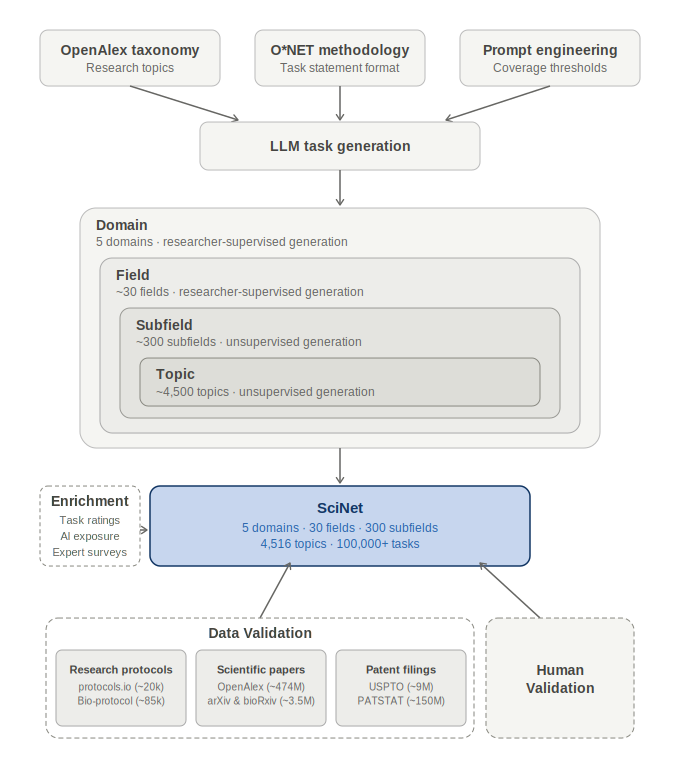

# SciNET Methodology

SciNET is an [O\*NET](https://www.onetonline.org/) for science: a comprehensive, hierarchically organized database of research task statements covering approximately 4,500 research topics from [OpenAlex](https://openalex.org/). This document describes how the database was built — from taxonomy construction through task generation, external validation, and quality filtering.



---

## Table of Contents

1. [Background and Motivation](#1-background-and-motivation)
2. [Taxonomy: Building on OpenAlex](#2-taxonomy-building-on-openalex)
3. [Task Statement Design](#3-task-statement-design)
4. [Task Generation](#4-task-generation)
5. [Ground Truth Data](#5-ground-truth-data)
6. [Data Enrichment](#6-data-enrichment)
7. [Models and Infrastructure](#7-models-and-infrastructure)
8. [Ongoing and Future Work](#8-ongoing-and-future-work)
9. [Limitations](#9-limitations)

---

## 1. Background and Motivation

**[O\*NET](https://www.onetonline.org/)** (the Occupational Information Network) is the U.S. government's primary database of occupational characteristics. For hundreds of occupations, [O\*NET](https://www.onetonline.org/) records detailed task statements — collected through surveys of incumbent workers — and rates each task on three scales: how important it is, what fraction of workers perform it, and how frequently it is performed.

Scientific research is largely absent from [O\*NET](https://www.onetonline.org/) at useful resolution. [O\*NET](https://www.onetonline.org/) has entries for broad categories like "Biological Scientists" or "Economists," but not for the granular topics — Gene Editing, Monetary Policy, Quantum Computing — where research work actually differs. SciNET fills this gap by applying the [O\*NET](https://www.onetonline.org/) methodology at the level of [OpenAlex](https://openalex.org/) research topics.

The primary output is **~100,000+ task statements** organized across ~4,500 topics, ~250 subfields, and 26 fields.

---

## 2. Taxonomy: Building on OpenAlex

### 2.1 Starting point: the OpenAlex hierarchy

We began with the [OpenAlex](https://openalex.org/) topic classification, which organizes scholarly works into four levels:

| Level | Count | Example |
|-------|-------|---------|
| Domain | 5 | Physical Sciences |
| Field | 26 | Physics and Astronomy |
| Subfield | ~250 | Condensed Matter Physics |
| Topic | ~4,500 | Superconductivity and Magnetic Properties |

Each [OpenAlex](https://openalex.org/) topic comes with a short summary, keywords, and (where available) a Wikipedia link. These metadata are included in [`data/openalex_topics.csv`](data/openalex_topics.csv) and serve as context in the task-generation prompts.

### 2.2 Redefining fields and subfields

While [OpenAlex](https://openalex.org/) provides a useful starting taxonomy, its field-level groupings do not always match how researchers think of their disciplines. For example, [OpenAlex](https://openalex.org/) groups Economics, Sociology, and Psychology under a single "Social Sciences" field, but these are quite different research communities.

We addressed this by creating approximately 30 **display fields** that more closely track disciplinary boundaries. Some [OpenAlex](https://openalex.org/) fields were **split** (e.g., "Social Sciences" became Economics, Sociology, Political Science, Psychology, etc.) and some were **merged**. This is possible because [OpenAlex](https://openalex.org/) topics — the most granular level — can be freely rearranged across new field boundaries.

The mapping uses a two-pass approach:

1. **Rule-based assignment.** Most subfields can be deterministically mapped to a display field (e.g., "Cardiology" → Medicine & Clinical Sciences). Subfields that do not map unambiguously are flagged.
2. **LLM-based classification.** For ambiguous cases, a language model classifies the topic into one of the 30 display fields given the topic's name, keywords, and summary. Batches of up to 15 topics are processed per API call for efficiency.

We then asked the language model to define the major subfields within each display field — essentially asking, "If you were a researcher in Economics, how would you organize the major subfields?" These LLM-proposed subfields replaced the [OpenAlex](https://openalex.org/) subfield labels where they were unintuitive, and we then mapped each [OpenAlex](https://openalex.org/) topic into the newly defined subfields.

---

## 3. Task Statement Design

All SciNET tasks follow the [O\*NET](https://www.onetonline.org/) canonical task statement structure. The prompts used for task generation closely follow the instructions that [O\*NET](https://www.onetonline.org/) gives to human analysts:

```
[Action Verb] + [Object] + [Modifiers] + [Purpose]
```

**Writing rules (drawn from [O\*NET](https://www.onetonline.org/) analyst guidelines):**

- Begin with a present-tense action verb (e.g., *Analyze*, *Design*, *Develop*, *Estimate*, *Collect*)
- Include the object being acted on
- Add optional modifiers specifying how or under what conditions
- End with an optional purpose introduced by "to …"
- One core action per statement; avoid chained steps
- Approximately 8–18 words
- Plain language; avoid jargon unless necessary for precision
- Parallel structure across statements; mutual exclusivity encouraged

**Reference examples from [O\*NET](https://www.onetonline.org/):**

> "Analyze data from research conducted to detect and measure physical phenomena."

> "Plan, design, or conduct surveys using questionnaires, focus groups, or interviews."

> "Compile, analyze, and report data to explain economic phenomena and forecast trends."

Tasks are written at the level of a *research team*, not a single individual. Statements describe what a typical researcher in the field *does*, not what they might occasionally do.

### 3.1 Prompt design

Controlling specificity is the central design challenge. The prompt includes the [O\*NET](https://www.onetonline.org/) analyst instructions nearly verbatim, together with explicit constraints against over-specificity: "AVOID HYPERSPECIFIC TASKS," "AVOID EXAMPLES THAT ARE TOO SPECIFIC, such as hyperspecific methodologies or datasets," and "CONSOLIDATE AGGRESSIVELY — if multiple tasks require the same skills or are part of the same workflow, combine them into ONE task." Coverage thresholds (see [Section 4.4](#44-coverage-thresholds) below) push the model toward tasks that a *majority* of researchers in the area perform regularly, reinforcing the same principle.

---

## 4. Task Generation

SciNET uses a **top-down hierarchical generation** approach. Starting at the most general level (universal tasks common to all researchers), the pipeline works downward through progressively more specific levels. At each step, the language model receives all tasks already defined at parent levels and generates refinements — tasks that are genuine specializations of their parents, not repetitions of what has already been captured above. Every subfield task must map to a specific domain parent, and every topic task must map to a specific subfield parent, ensuring the full hierarchy is traceable from any topic-level task up to a universal task.

### 4.1 Level structure

| Level | Scope | Source | Coverage threshold |
|-------|-------|--------|--------------------|
| Universal | All researchers | LLM-generated, researcher-supervised | — |
| Domain | e.g., Social Sciences | LLM-generated, researcher-supervised | — |
| Subfield | e.g., Economics | LLM-generated (unsupervised) | ≥ 70% of subfield researchers |
| Topic | e.g., Labor Market and Education | LLM-generated (unsupervised) | ≥ 80% of topic researchers |

### 4.2 Supervised levels (Universal and Domain)

The universal and domain levels anchor the entire hierarchy and needed to be correct. Rather than writing these tasks from scratch, we developed them through an iterative process with Claude Opus: the model drafted candidate tasks, a researcher reviewed them, flagged issues, and the model revised — repeating until the tasks reflected the right level of granularity and mutual exclusivity. The result is LLM-generated content that has been carefully vetted.

**Universal tasks**

These tasks apply to virtually all researchers regardless of field, organized into seven categories: Ideation & Hypothesis Generation, Data Gathering, Data Analysis, Writing & Communication, Peer Review & Service, Mentorship & Teaching, and Administration & Collaboration. Examples include "Identify gaps in existing literature to formulate novel research questions," "Draft manuscripts describing research questions, methods, results, and interpretations," and "Manage research budgets, personnel, and project timelines."

The universal level ensures that tasks like grant writing, peer review, and mentoring — which are never mentioned in papers or protocols — are still represented in every researcher's task profile.

**Domain tasks**

Domain tasks are domain-specific refinements of universal tasks, each explicitly linked to the universal task it refines. Four research domains are covered: Social Sciences, Life Sciences, Physical Sciences, and Health Sciences. Domain tasks capture practices characteristic of an entire research domain that would not apply across all domains — for example, IRB approval workflows in the Social Sciences and Health Sciences, instrument calibration procedures in the Physical Sciences, or biosafety protocols in the Life Sciences. These were developed in the same supervised iterative process described above.

### 4.3 Unsupervised levels (Subfield and Topic)

From the subfield level downward, task generation is fully automated. The language model receives the parent-level tasks as numbered input and must produce refinements that each map to a specific parent:

**Subfield prompt (excerpt):**

> You are generating task statements for researchers in {subfield\_name} (a subfield of {domain\_name}).
>
> INPUT: DOMAIN TASKS ({domain\_name})
> These are the domain-level tasks. Your job is to generate subfield-specific refinements of these.
>
> OBJECTIVE: Generate subfield-specific refinements of the domain tasks above. Each subfield task you generate should:
> - Refine ONE specific domain task (specify which domain task number it refines)
> - Be specific to {subfield\_name} (would NOT apply to other subfields)
> - Be common enough that **70%+ of {subfield\_name} researchers** do it regularly

**Topic prompt (excerpt):**

> Each topic task you generate should:
> - Refine ONE specific subfield task (specify which subfield task number it refines)
> - You DO NOT need to have one topic task for each subfield task. You may skip some subfield tasks, and some subfield tasks may have multiple topic tasks.
> - Be specific to {topic\_name} (would NOT apply to other topics in {subfield\_name})
> - Be common enough that **80%+ of {topic\_name} researchers** do it regularly

Each generated task includes an explicit parent ID linking it to the domain task (for subfield tasks) or subfield task (for topic tasks) it refines, enabling full parent-chain tracing from any topic-level task up to the relevant universal task.

### 4.4 Coverage thresholds

The coverage thresholds (70% at the subfield level, 80% at the topic level) serve a dual purpose. They push the model toward tasks that represent common, substantial research activities — analogous to [O\*NET](https://www.onetonline.org/)'s concept of "relevance" — and they push against overly specific tasks (e.g., a particular niche dataset or one-off technique) that would inflate the task count without adding representational value. The tighter threshold at the topic level reflects that topic tasks should be highly characteristic of the specific research area.

**Execution:** Subfield tasks are generated in parallel using a thread pool. Topic tasks are generated via the [Anthropic Batch API](https://docs.anthropic.com/en/docs/build-with-claude/message-batches), which processes hundreds of topics concurrently.

### 4.5 Deduplication and quality control

- **Prompt-level:** The model is instructed to ensure mutual exclusivity across tasks and to avoid vague catch-all statements ("analyze data," "collect data"). Parent tasks are provided in the prompt explicitly so the model can avoid paraphrasing them.
- **Code-level:** After parsing model responses, a normalization function deduplicates tasks by exact string match after whitespace normalization.
- **Error handling:** If a model response cannot be parsed as valid JSON, a regex fallback extracts the task list from code blocks or raw text. Unparseable responses are logged as errors without discarding the run. All generation is checkpointed so interrupted runs can resume.

---

## 5. Ground Truth Data

A central question is whether the LLM-generated tasks actually reflect what researchers do in practice. We collect several types of external ground-truth data — research protocols, papers, patents, and direct input from researchers — that document real research activity independently of any LLM. Each source serves both to validate existing tasks and to surface activities that may be missing.

### 5.1 Research Protocols

Detailed step-by-step research protocols are our most granular ground-truth source: they describe exactly what a researcher does, in what order, at the level of individual actions. We draw on two complementary protocol corpora.

**[Protocols.io](https://www.protocols.io/)** is a platform where researchers publish laboratory and research protocols, covering a wide range of disciplines. We assembled a corpus of approximately 20,600 protocols from three sources: public protocols via the protocols.io API, unlisted protocols with DOIs indexed in [OpenAlex](https://openalex.org/), and additional protocols identified through CrossRef under the protocols.io DOI prefix (10.17504). Because protocols.io protocols carry DOIs, the vast majority can be merged with [OpenAlex](https://openalex.org/), giving us the field and — in principle — the topic each protocol belongs to. We found, however, that [OpenAlex](https://openalex.org/)'s topic-level classification for protocols was often inaccurate, so we built an LLM-based assignment pipeline to route each protocol to the correct SciNET field, subfield, and topic.

Each protocol is routed to the SciNET topic it best represents and then checked step by step for coverage against existing tasks:

1. **Field validation.** A language model checks whether the [OpenAlex](https://openalex.org/)-assigned field is correct given the protocol title, abstract, and first three steps, and corrects it if not. (In pilot runs, roughly 70% of protocols had incorrect [OpenAlex](https://openalex.org/) field assignments.)
2. **Subfield assignment.** Given the corrected field, the model selects the best subfield.
3. **Topic assignment.** The model selects the best-matching SciNET topic from candidates within the subfield, providing a confidence score (1–5). Only protocols with confidence ≥ 4 are used in downstream analysis.
4. **Step coverage.** For each procedure step, the model determines whether it is covered by any existing SciNET task at the topic, subfield, or field level. Steps are classified as *placeholder* (instructions to follow a prior protocol, excluded), *prep* (routine preparatory actions), or *substantive* (steps corresponding to meaningful research tasks). Coverage is the fraction of non-placeholder steps matched to a SciNET task.

With correct field routing, step coverage exceeds 85% for most protocols. Uncovered steps are not discarded: they are grouped by topic, a language model proposes new [O\*NET](https://www.onetonline.org/)-style task statements to cover them, and proposed tasks are deduplicated against existing SciNET tasks (sequence similarity threshold: 90%) before being added to the database.

**[Bio-Protocol](https://bio-protocol.org/)** is a peer-reviewed journal publishing detailed experimental protocols primarily in the life sciences. A corpus of approximately 85,000 protocols was collected, each including procedure steps with durations, materials lists, and author affiliations. This corpus provides complementary coverage in molecular biology and related domains that are well-represented in Bio-Protocol but less so in protocols.io. We also collect video protocol transcripts, where researchers narrate their procedures in spoken walkthroughs, and process them through the same coverage pipeline.

### 5.2 Research Papers

Full-text research papers are a rich source of information about what researchers do, particularly in computational, theoretical, and social science fields that are underrepresented in laboratory protocol databases. Methods sections describe in the authors' own words the procedures, tools, and approaches used in a study. We access full-text papers through [OpenAlex](https://openalex.org/), arXiv, and other open repositories, and apply the same topic-assignment and coverage pipeline used for protocols to extract research activities and identify gaps in SciNET's task coverage.

### 5.3 Patents

Patent filings describe research and development processes in precise, structured language. We collect patent data and apply the same LLM-based pipeline to route patents to SciNET topics and check whether the activities described are covered by existing tasks. Patents are particularly informative for applied research and engineering topics where protocol databases have limited coverage.

### 5.4 Human Researchers: Surveys and Expert Evaluations

Ultimately, the most direct ground truth comes from researchers themselves. We collect two types of human input:

**Researcher surveys.** We are developing a survey instrument that asks researchers to evaluate SciNET tasks for their own field and topic — rating coverage (are important tasks missing?), importance, and time allocation. Responses provide direct human validation complementing the LLM-based ratings and a signal for which parts of the task database need the most attention.

**Expert evaluations.** In addition to broad surveys, we conduct structured evaluations with domain experts who review the task lists for specific subfields or topics, flagging errors, omissions, and tasks that are phrased at the wrong level of granularity. These evaluations inform iterative prompt improvements and targeted task additions.

---

## 6. Data Enrichment

Beyond the task statements themselves, SciNET enriches each field and subfield with additional data that characterize research communities and the scientific landscape more broadly. This enrichment falls into three categories: task-level ratings following [O\*NET](https://www.onetonline.org/) methodology, bibliometric characteristics drawn from [OpenAlex](https://openalex.org/), and measures of AI adoption across fields.

### 6.1 Task ratings (Importance, Relevance, Frequency)

Following [O\*NET](https://www.onetonline.org/) methodology, each task is rated on three scales to indicate how central it is to a research area:

- **Importance (IM, 1–5):** How important is this task to researchers in this area?
- **Relevance (RT, 0–100%):** What share of researchers in this area perform this task?
- **Frequency (FT, 1–7):** How often is this task performed? (1 = yearly or less, 7 = hourly or more)

We replicate the [O\*NET](https://www.onetonline.org/) incumbent worker survey by prompting a language model to adopt the perspective of a researcher with 10+ years of experience in the target area and to rate all tasks simultaneously in a single API call. This batched approach provides consistency within a rating session.

The prompt includes explicit distribution anchors calibrated against [O\*NET](https://www.onetonline.org/) ground truth for scientific occupations — for example, for Relevance: "100 should be your most common answer — use it for ~30% of tasks"; for Importance: "Most tasks should be rated 3–4; only a small minority receive 5." These anchors correct for a systematic tendency in LLMs to underestimate the share of researchers who perform common tasks and to overrate task importance. The calibrated prompt was validated against 425 researcher-relevant [O\*NET](https://www.onetonline.org/) tasks across 40 scientific occupations, yielding Pearson correlations of r = 0.60 (Importance), r = 0.63 (Relevance), and r = 0.76 (Frequency).

Based on these ratings, tasks are classified as **Core** (Relevance ≥ 50% and Importance ≥ 3.0) or **Supplemental**. The Relevance threshold of 50% is set below [O\*NET](https://www.onetonline.org/)'s conventional 67% to account for the systematic downward bias identified during calibration.

### 6.2 Bibliometric characteristics from OpenAlex

For each SciNET field and subfield, we compute a set of bibliometric indicators from [OpenAlex](https://openalex.org/) that describe the research community's publication activity and output quality:

- **Publication volume.** Total paper count and citation count per field and subfield, aggregated from topic-level data.
- **AI-mention trends.** Yearly counts of papers that mention AI-related terms (e.g., "artificial intelligence," "machine learning," "large language model") as a fraction of all papers in the field, tracking how rapidly AI is entering different research communities.
- **Publication delay.** Average number of days from journal submission to publication, where available, as a proxy for research pace and review intensity.

These indicators are computed at the subfield level by aggregating topic-level [OpenAlex](https://openalex.org/) data and are used to contextualize task profiles — for instance, a subfield with rapidly rising AI-mention rates may have a different distribution of AI-augmentable tasks than one where AI adoption is slow.

### 6.3 Verifiability and research quality indicators

We construct a verifiability index for each subfield, capturing the degree to which research outputs are presented in ways that facilitate independent replication and scrutiny. The index aggregates three component measures at the topic level, weighted by paper count:

- **Retraction rate.** The fraction of papers in the topic that have been retracted, as a signal of systematic quality failures.
- **Hedging language.** Frequency of hedging words per 100 words in abstracts (e.g., "may," "suggest," "appear"), reflecting epistemic caution in how findings are communicated.
- **Booster language.** Frequency of booster words per 100 words (e.g., "clearly," "demonstrate," "establish"), reflecting overstatement tendencies.

Each subfield receives a percentile rank on the composite index and on each component, enabling cross-field comparisons of research norms and output characteristics.

---

## 7. Models and Infrastructure

| Component | Model | Notes |
|-----------|-------|-------|
| Task generation (subfield + topic) | Claude Opus 4.5 | Unsupervised hierarchical refinement |
| Universal/domain task development | Claude Opus 4.5 | Iterative, researcher-supervised |
| Protocols.io validation | Claude Sonnet 4.5 | Multi-phase routing and coverage |
| Rating calibration | Claude Opus 4.5 | [O\*NET](https://www.onetonline.org/) gold-standard comparison |
| Field/subfield classification | Claude Sonnet 4.5 | Taxonomy mapping |

All models are accessed via the Anthropic API. Topic-level task generation uses the [Anthropic Batch API](https://docs.anthropic.com/en/docs/build-with-claude/message-batches), which provides a 50% cost reduction and higher throughput. Prompt caching (ephemeral) is used for system prompts and shared context blocks. All long-running pipeline steps checkpoint results incrementally so that interrupted runs can resume without reprocessing completed items.

---

## 8. Ongoing and Future Work

The ground truth collection described in [Section 5](#5-ground-truth-data) is ongoing. Several components are in active development:

- **Expanded protocols.io coverage.** The pilot used 1,000 protocols; the remaining ~19,600 in the corpus are being processed to identify further gaps and generate additional tasks.
- **Broader paper coverage.** Full-text processing is being extended to a larger sample of [OpenAlex](https://openalex.org/) and arXiv papers, with particular attention to computational, theoretical, and social science fields.
- **Patent pipeline.** The routing and coverage pipeline is being adapted for patent filings, which follow a different document structure.
- **Survey deployment.** The researcher survey instrument is being piloted with early respondents and will be expanded to a broader panel of scientists.

---

## 9. Limitations

**LLM as simulated respondent.** The coverage thresholds (70%, 80%) and the Core/Supplemental classification rely on LLM judgments, not surveys of actual researchers. While correlations with [O\*NET](https://www.onetonline.org/) human surveys are meaningful (r = 0.60–0.76), the LLM is not a perfect proxy for incumbent workers. The calibration exercise used scientific occupations from [O\*NET](https://www.onetonline.org/), but these are broader than SciNET's specific topics.

**English-language bias.** Task statements are generated in English using English-language topic labels and keywords. Research practices may differ across linguistic or cultural contexts not well-represented in either [O\*NET](https://www.onetonline.org/) or the underlying LLMs' training data.

**[OpenAlex](https://openalex.org/) taxonomy drift.** [OpenAlex](https://openalex.org/) periodically revises its topic labels and assignments. The `old_topic_label` and `new_topic_label` columns in `openalex_topics.csv` reflect a specific label revision; downstream uses should verify topic IDs rather than relying solely on label strings.

**Protocol coverage bias.** The protocols.io and Bio-Protocol corpora skew toward experimental life sciences and biomedicine. Coverage validation for computational, social science, and humanities research topics is more limited — which is part of the motivation for extending to full-text papers, patents, and researcher surveys (see [Section 5](#5-ground-truth-data)).

---

## References

- Arts, S., Cassiman, B., & Gomez, J. C. (2025). *Beyond Citations: Measuring Novel Scientific Ideas.*
- Liang, W., et al. (2024). Mapping the Increasing Use of LLMs in Scientific Papers. *arXiv:2404.01268.*
- Peterson, N. G., Mumford, M. D., Borman, W. C., Jeanneret, P. R., & Fleishman, E. A. (2001). Understanding Work Using the Occupational Information Network ([O\*NET](https://www.onetonline.org/)). *Personnel Psychology*, 54(2), 451–492.
- Waltman, L., & van Eck, N. J. (2012). A new methodology for constructing a publication-output indicator. *Journal of the American Society for Information Science and Technology*, 63(12), 2378–2392.
